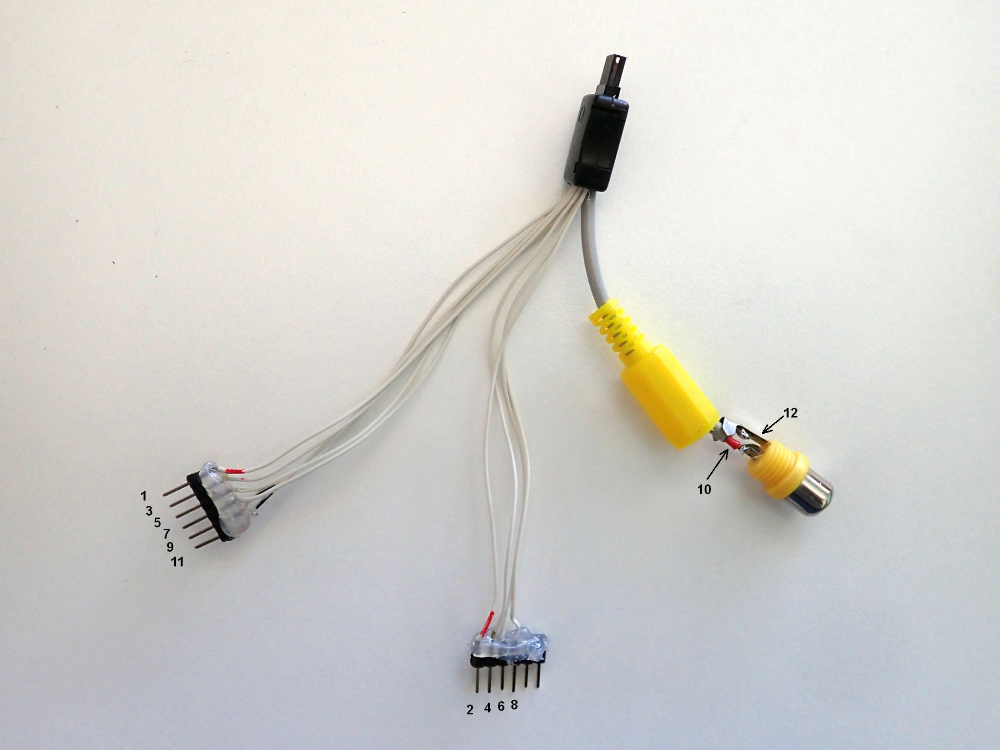
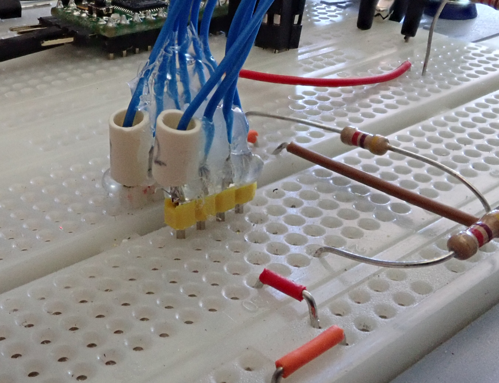
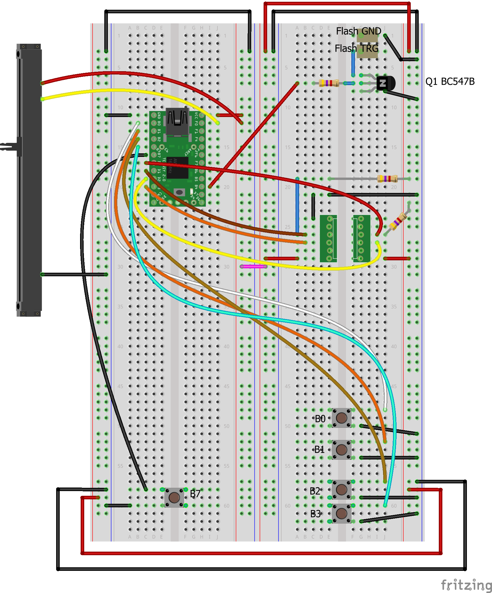
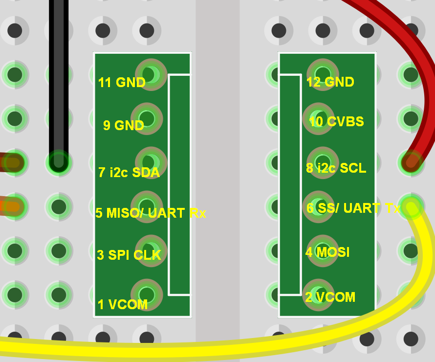
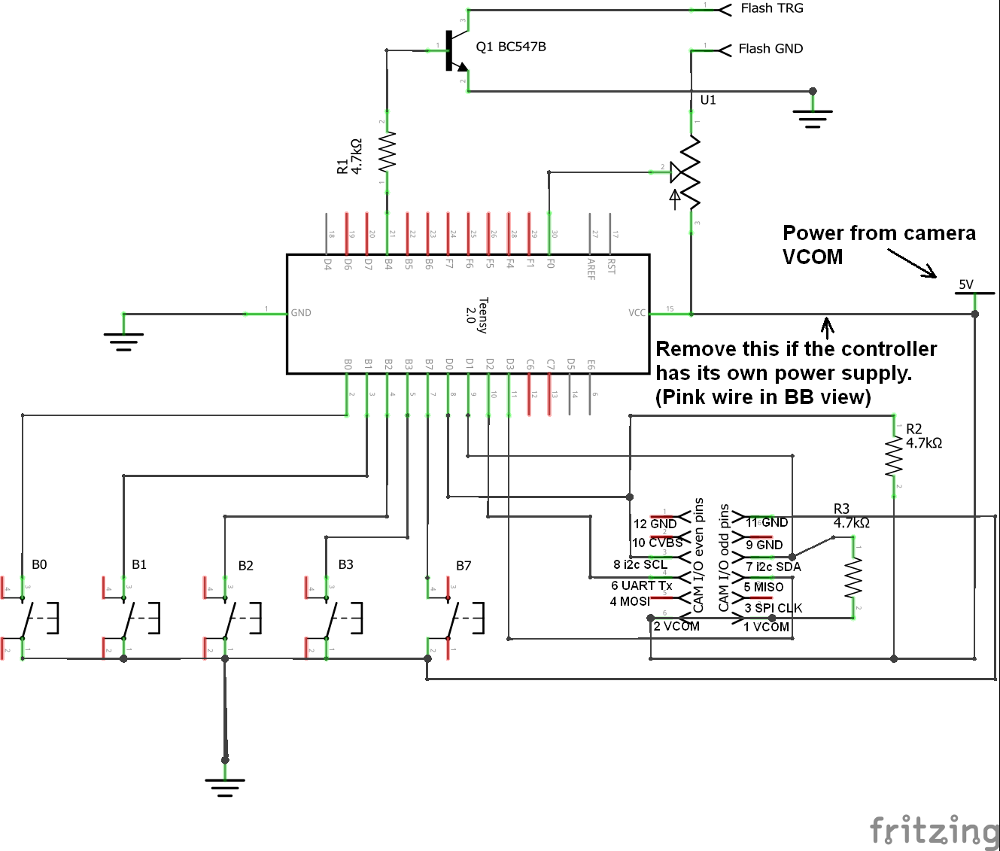
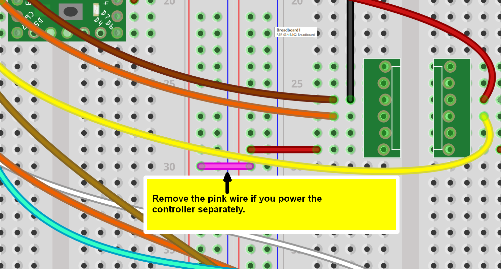

# Z-CAM-E1-IO

## Cabling for the camera and the breadboard.

I have made a couple of cables (I have several breadboards for the E1 going) using ordinary pin headers and plugs I've found on eBay.
 
Finding the plugs have not been easy, as there is scarce info about which type to use. I have found two different, working plugs on eBay, one of which is no longer available and [this one](https://www.ebay.co.uk/itm/12-x-Mini-USB-Plug-Male-12-Pin-Used-for-SAMSUNG-Product/180396604436), which I'm using right now.

I made this picture of the camera's I/O port pinout a while ago. I have taken the pin numbering from [Z CAM's own picture](https://github.com/imaginevision/Z-Camera-Doc/blob/master/expansion/pin.jpg), which is the only illustration showing all the port's pins I've found. The pin numbering they use does not match up with the one the plug manufacturer use, but I'll use Z CAM's throughout anyway, to avoid confusion.

This is what one of my cables looks like.

Standard pin headers with some hot glue over the solder points, to keep the pins from escaping from the plastic part they are sitting in.
There are two pin headers, one with the odd numbered pins and the other with the even numbered ones.
The header pin numbers shown are those of the camera's I/O port pins. Camera's pins 10 and 12 (CVBS) goes directly to a RCA connector and are not connected to the breadboard headers.

Here's another of my cables, in the breadboard.

In the background, you can see that I've not used a coaxial cable for the CVBS connector. For short runs of composite video, a twisted pair suffices.

Even numbered pins. No pins 10 and 12 (CVBS), since they go directly from the camera to the RCA connector.

## Breadboard set-up
Fritzing image of the breadboard:

Detail showing the camera connection to the breadboard:

A schematic of the above:

## Caveats
NOTE!!  In the pictures above, the breadboard is set up to power the microcontroller from the camera.
If you will power the controller separately, e.g. from its USB connector while developing your sketch, remove the pink wire.
Otherwise the camera's and the controller's power supplies will fight each other and that seldom ends well...

