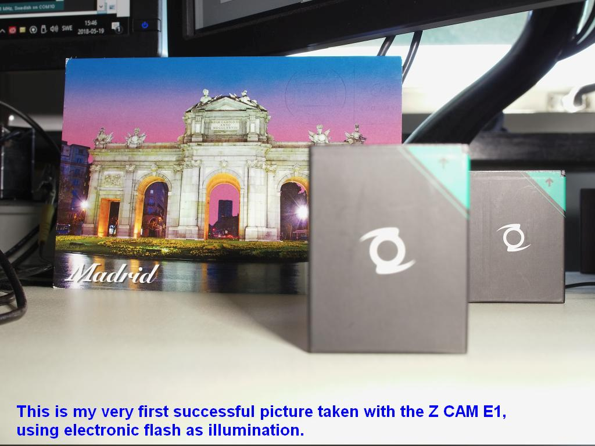
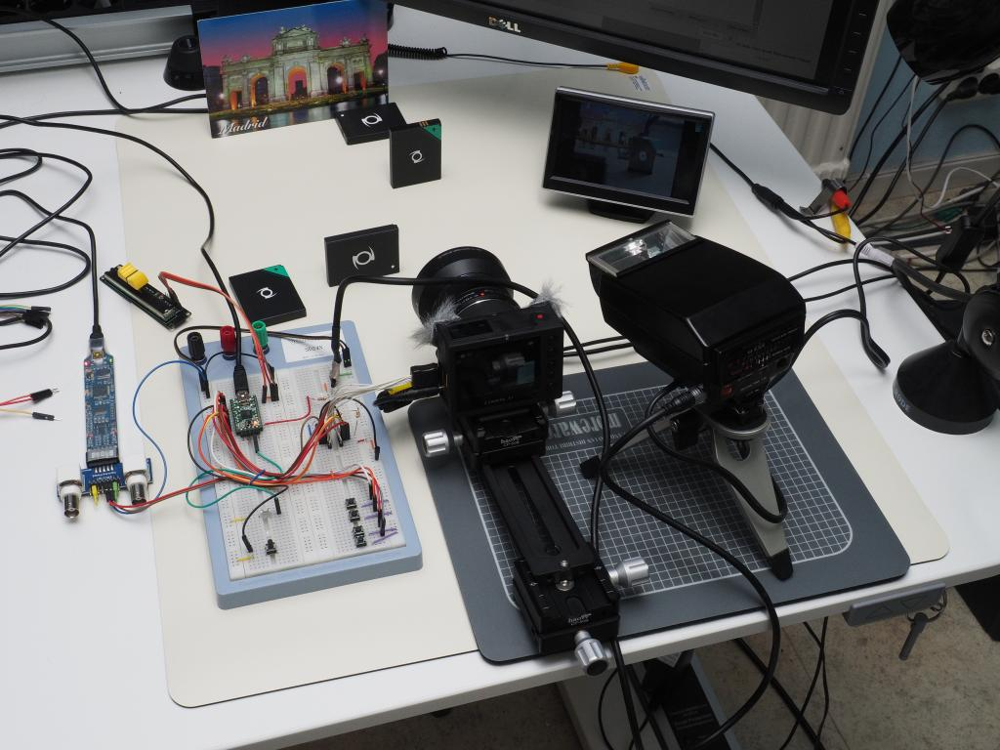
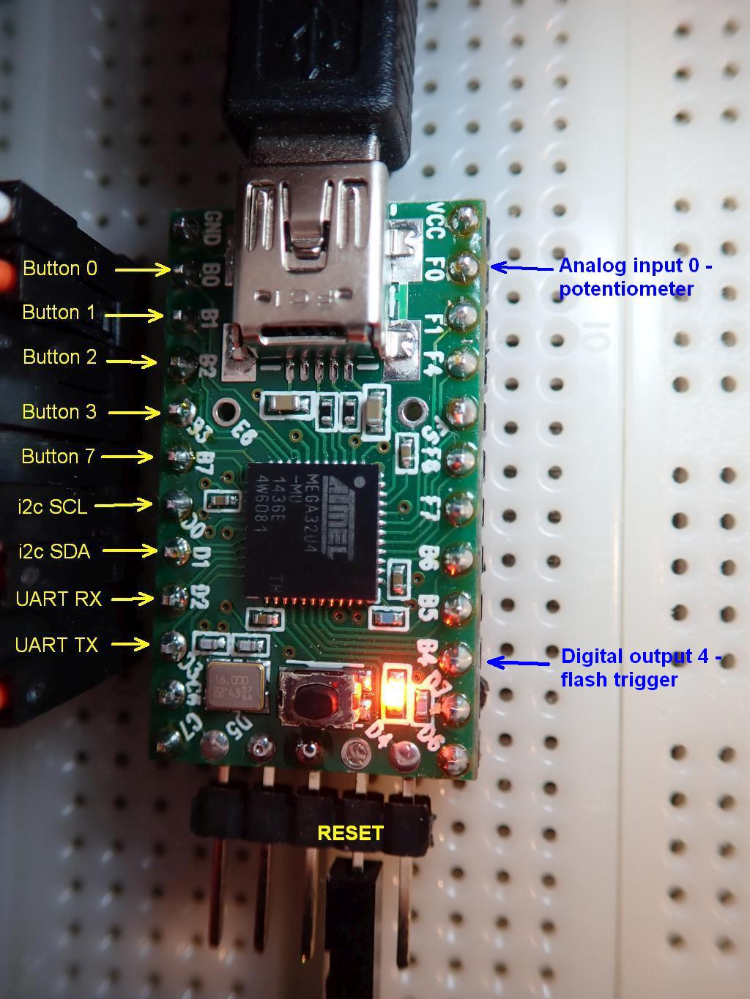
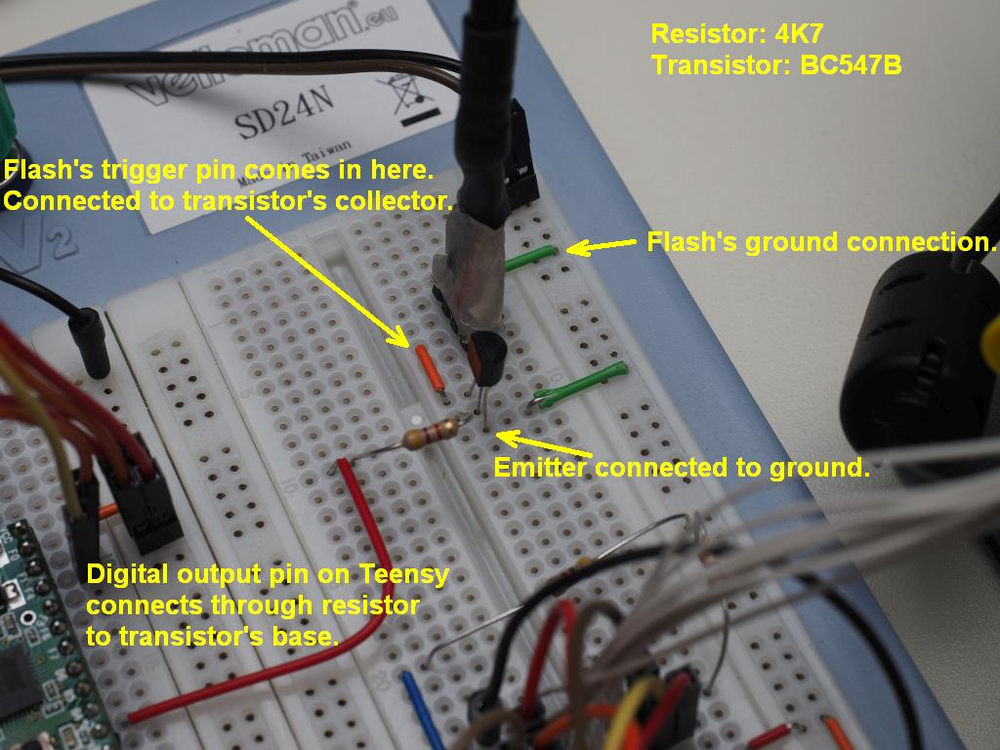
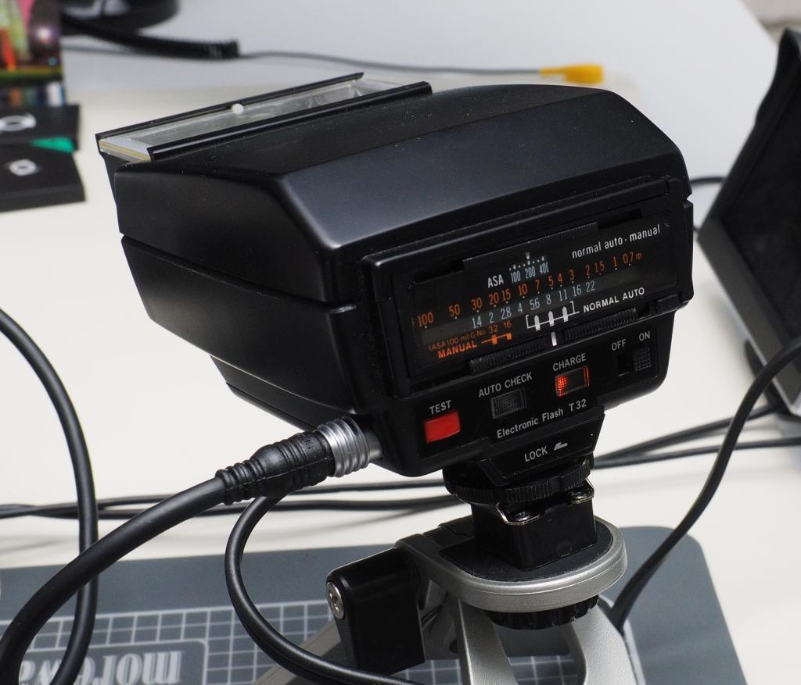

# Z-CAM-E1-IO
Firing an external flash from a Teensy digital output pin.

In this folder you will find a Teensy/Arduino sketch that shows how to fire an electronic flash from a digital output pin. The only extra components you need are a resistor and a transistor.

The code is just a proof of concept. It's definitely not production ready.

The Z CAM E1 was never designed to sync with electronic flash and it shows. The major obstacle is the electronic shutter with its slow read-out time. That means that the shutter speed needs to be kept low, in my tests anything faster than about 1/20 second results in dark bands at the upper or lower edges.

The next hindrance is the delay between "pressing the button" to take a picture and the picture actually being taken. The delay is ~150 milliseconds. It's easy to implement a delay as such on an Arduino, but the camera's delay isn't consistent, it changes a couple of milliseconds up and down from shot to shot in an unpredictable manner. It can be worked around by choosing a slow shutter speed and combine that with a small aperture, which calls for stronger flash output, i.e. longer burn times.

Test setup. Bitscope Micro oscilloscope/logic analyzer, breadboard with a Teensy 2.0, batteries and a nice postcard from Spain as focus targets, the camera itself, 5" CVBS monitor and an old analog flash from my Olympus OM film days.
Apart from the added transistor circuit, the breadboard is wired exactly the same as in the [Focus setup](https://github.com/RagnarJensen/Z-CAM-E1-IO/tree/master/Focus). Two of the buttons have different functions here, though. Buttons 2 and 3 are used for changing the flash delay.

Which pin is what on the Teensy 2.0

Digital output pin on Teensy 2.0 connects to flash's trigger pin via a transistor. When the Teensy's digital pin goes HIGH, the transistor conducts, pulling the flashs' trigger voltage down and that sets the flash off.

The resistor value isn't critical, you just need enough current to the base to get the transistor to saturate. The transistor type isn't critical either. Just about any small-signal NPN will probably do.

Beware of high trigger voltage, though!!! Some flashes from the Good Old Days can have several hundred volts on the trigger pin. Measure before you connect...

For my tests, I use an old Olympus T-32 flash. I have six of them. I like them a lot, because they are quite powerful in a small package. The reflector can tilt up to 90º and down 7º (for close-ups) and they can be powered from mains AC.  They have a connector on the side that mirrors the pins on the foot (they are actually wired in parallel), making it easy to connect several of them to each other in a multi-flash setup. Chopping up a cable makes it as easy to connect them to other things, too :wink:

