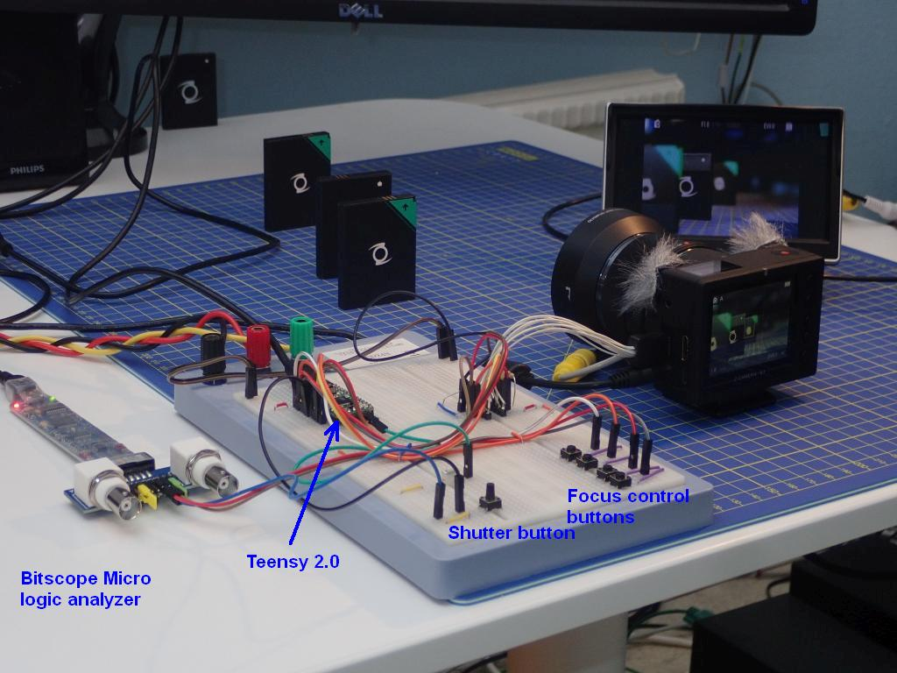
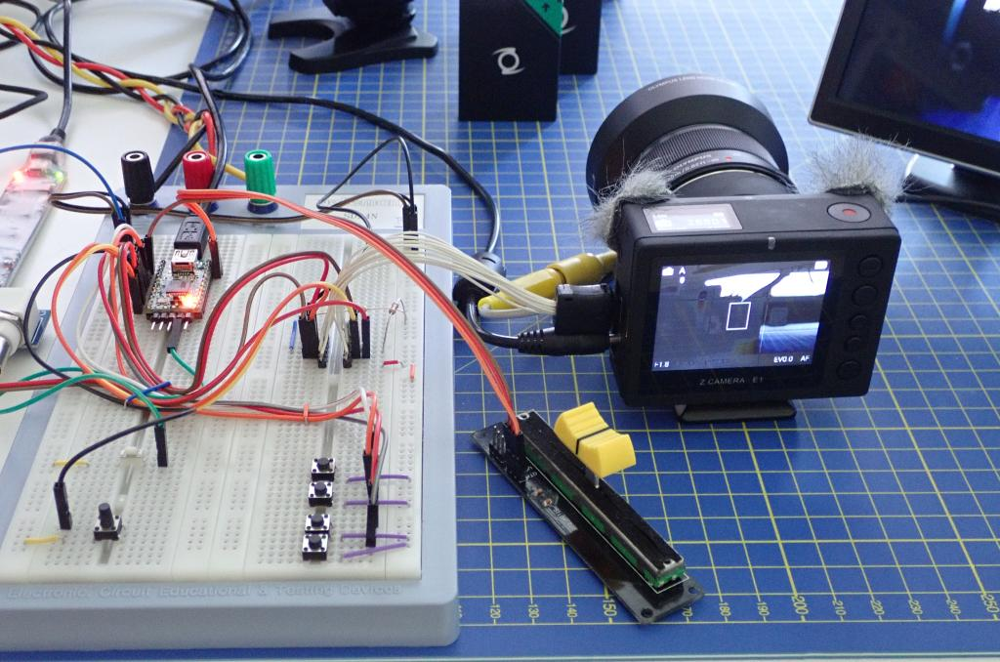

# Z-CAM-E1-IO
Controlling lens focus on the Z CAM E1 through its I/O port.

In this folder you will find a Teensy/Arduino sketch that shows how to send commands over the UART lines, to control the focus of the lens.

The code is just a proof of concept. It's definitely not production ready.

Bitscope oscilloscope/logic analyzer, breadboard, camera, batteries as focus targets and a CVBS monitor.
The grey, furry things on the camera are [Rycote Micro Windjammers](https://rycote.com/microphone-windshield-shock-mount/micro-windjammers/).

Which pin is what on the Teensy 2.0

The breadboard set up for UART control with push buttons.

The breadbord with a potentiometer added, for analog input.

