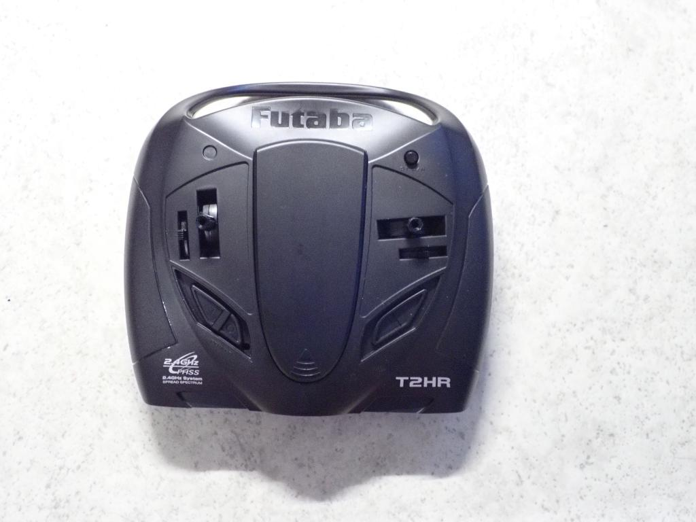
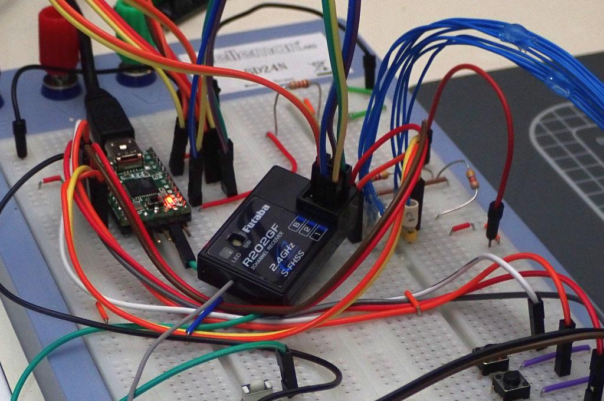
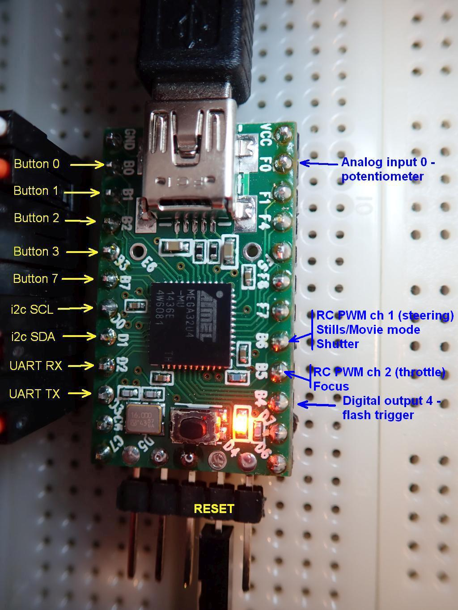

# Z-CAM-E1-IO
Controlling recording mode, shutter and lens focus on the Z CAM E1 through its I/O port, with a RC system.

In this folder you will find a Teensy/Arduino sketch that shows how to send commands over the UART lines, to control various aspects of the Z CAM E1.
Input to the Teensy comes from a model car/boat Radio Control system.

In this sketch, the RC controls are used like this;
 Move Channel 1 (steering) stick to the left to switch between stills and movie mode, move the stick to the right to take a still picture or start/stop movie recording.
 Channel 2 (throttle) controls lens focus. Just move the stick forwards/backwards to change the lens focus position.

This sketch is basically the same as the "Flash" one, only with the PWM input added on.

As always, the code is just a proof of concept. It's definitely not production ready.

The RC transmitter, a simple 2-channel Futaba T2HR. The left stick is for a throttle and/or forward/reverse control, the right stick controls steering.

The RC receiver. Its two PWM outputs are simply connected to the Teensy's pins 14 and 15.

Which pin is what on the Teensy 2.0

