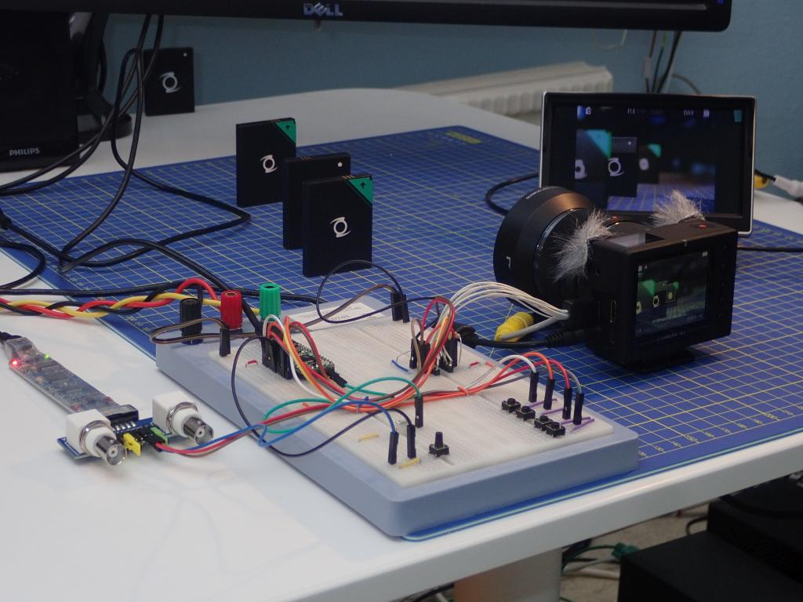
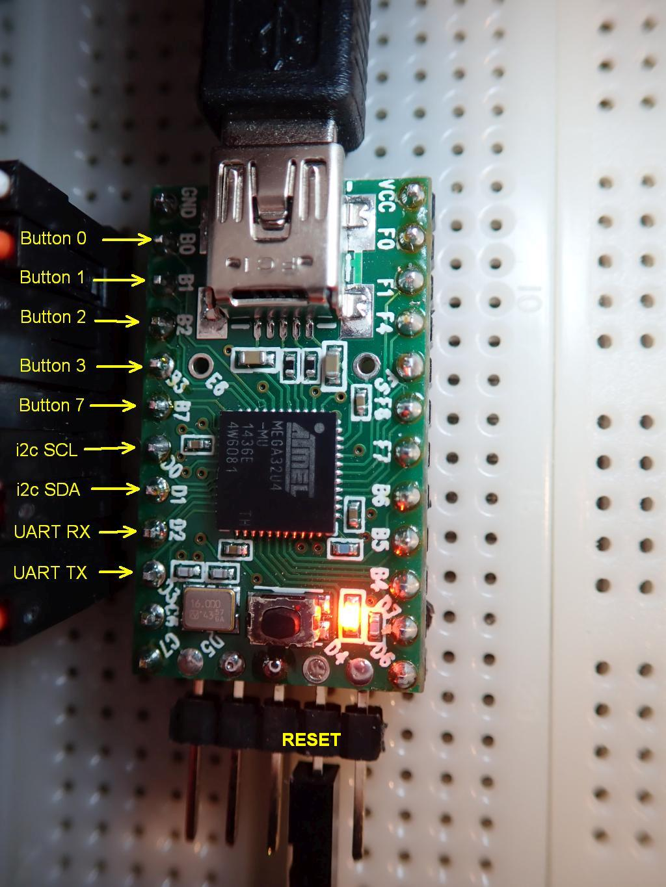
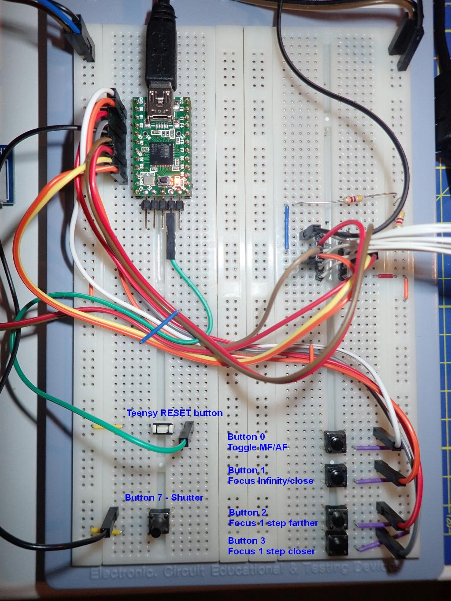

# Z-CAM-E1-IO
Controlling the Z CAM E1 through its I/O port.

This repository will hold bits and bobs from my experiments with the Z CAM E1's I/O port
and the API described at https://github.com/imaginevision/Z-Camera-Doc.

I test on a close relative to the Arduino, a Teensy 2.0 by pjrc.com

Bitscope oscilloscope/logic analyzer, breadboard, camera, batteries as focus targets and a CVBS monitor.

Which pin is what on the Teensy 2.0

The breadboard set up for UART control.
The two resistors on the right are pull-ups for the i2c lines.

